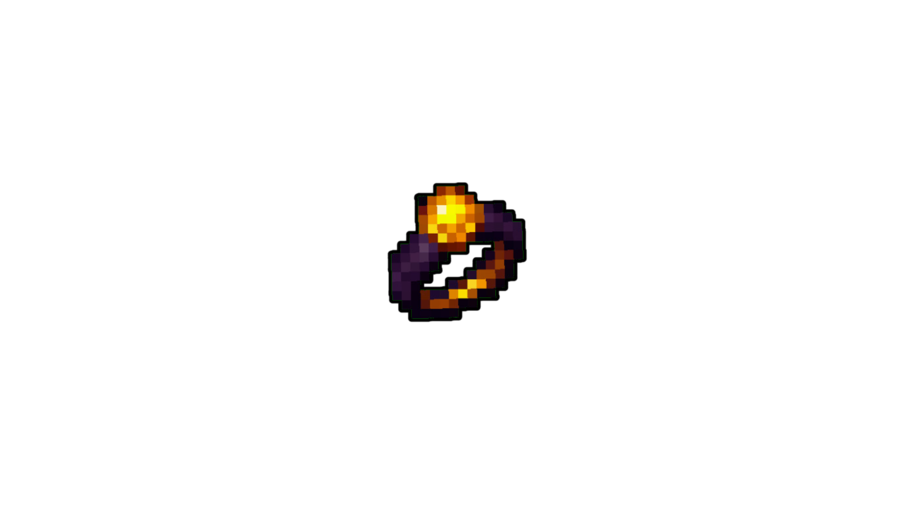

# Anillo del Minero

<figure><figcaption>
Anillo del Minero
</figcaption></figure>

## Forma de obtención

* Se puede obtener de [Cofre de Madera](../../../../extra/loot/chest/wood\_chest.md) en [Mina](../../../../location/mine/mine.md)

| Nivel | Bonus      |        | Defensa |             |
| ----- | ---------- | ------ | ------- | ----------- |
| 5     | Movimiento | 1      | Evasión | 2.5 \~ 7.5% |
|       | Fuerza     | 1 \~ 3 |         |             |
|       |            |        |         |             |
